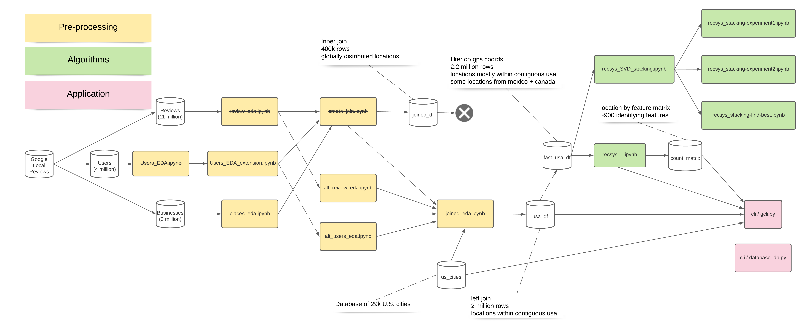

## Web and Big Data Mining - Team G-Unit

An SJSU project by Somya, Jaewoong, and Ward

Dataset used: https://cseweb.ucsd.edu/~jmcauley/datasets.html#google_local

### Project Event Flow

### Instructions to run cli
- pip3 install -r requirements.txt
- gunzip --keep cli/usa_df_content.csv.gz > cli/usa_df_content.csv
- ./cli/gcli.py --location {"City, State" or "long, lat"} --categories {cat1, cat2}

### Examples:
- Example1: `./cli/gcli.py --location "Fort Lauderdale, FL" --categories sushi buffet`

Example1 output

  

- Example2: `./cli/gcli.py --location "Bakersfield, CA" --categories indian buffet`

Example2 output

  

  - Example3: `./cli/gcli.py --location "San Jose, CA" --categories american`

Example3 output

  

  - Clear out the cached results: `./cli/clean.sh`

### Dependencies
- [Seaborn](https://seaborn.pydata.org/tutorial.html)
- [Geoplot](https://residentmario.github.io/geoplot/quickstart/quickstart.html)
- [thampiman/reverse-geocoder](https://github.com/thampiman/reverse-geocoder)
- [Rake nltk](https://pypi.org/project/rake-nltk/)
- [data/us_cities.csv](https://github.com/kelvins/US-Cities-Database)
